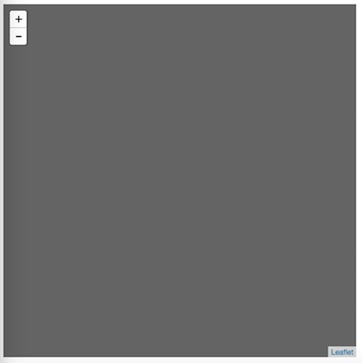
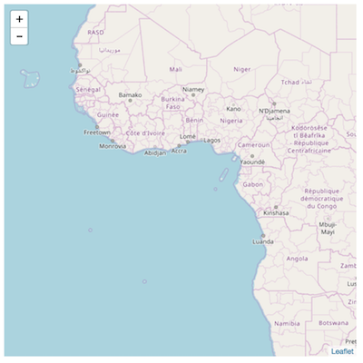
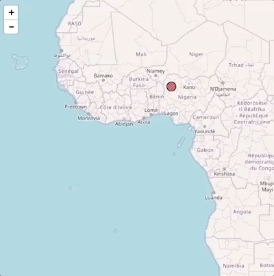
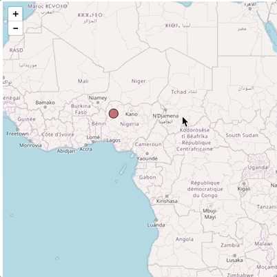
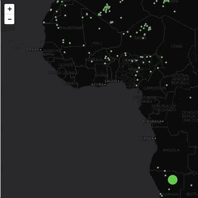

# Basic Tutorial

This tutorial will go over the basics of building a simple web page using [Mappa](https://github.com/cvalenzuela/Mappa), [p5.js](https://github.com/processing/p5.js) and [Leaflet](http://leafletjs.com/). If this is your first time working with web maps, you should check this [Introduction to Web Maps](../introduction). 

This tutorial uses [p5.js](https://github.com/processing/p5.js), but the same principles can be applied to any other graphics library. 

Here is the final result: [Meteorite Landings]()

## One Point

Open your favorite text editor and create a new html file, import p5.js and Mappa and create an empyt `script` tag in the body

```html
<!DOCTYPE html>
<html lang="en">

<head>
  <title>Basic Mappa Tutorial</title>
  <script src="https://cdnjs.cloudflare.com/ajax/libs/p5.js/0.5.16/p5.min.js" type="text/javascript"></script>
  <script src="https://unpkg.com/mappa-mundi/dist/mappa.min.js" type="text/javascript"></script>
</head>

<body>
  <script>
  
  </script>
</body>

</html>
```

Now all our work will be inside the `<script></script>` tags.

Start by creating our main variables and p5.js basic structure: `setup` and `loop`.

```js
// Create a variable to hold our map
var myMap;
// Create a variable to hold our canvas
var canvas;
// Create a new Mappa instance using Leaflet.
var mappa = new Mappa('Leaflet');

// p5.js setup
function setup(){
  // Create a canvas 640x640
  canvas = createCanvas(640,640); 
  // Add a grey background
  background(100);
}

// p5.js draw
function draw(){

}
```

If you open this page in a browser you should see this:


A grey rectangle. Not that exiting...

Now let's add 2 lines of code:

```js
var myMap;
var canvas;
var mappa = new Mappa('Leaflet');

function setup(){
  canvas = createCanvas(640,640);
  background(100);

  // Create a tile map with lat 0, lng 0, zoom 4
  myMap = mappa.tileMap(0,0,4); 
  // Overlay the tilemap on top of the canvas
  myMap.overlay(canvas);
}

function draw(){

}
```



A grey rectangle with zoom levels? Everything up to now is working, we just need to specify a set of tiles to use. Actually if you open your javascript console you should see a warning message:


So, let's use those tiles and try it again:

```js
var myMap;
var canvas;
var mappa = new Mappa('Leaflet');

// Lets put all our map options in a single object
var options = {
  lat: 0,
  lng: 0,
  zoom: 4,
  style: "http://{s}.tile.osm.org/{z}/{x}/{y}.png"
}

function setup(){
  canvas = createCanvas(640,640);
  // background(100); let's uncomment this, we don't need it for now

  // Create a tile map with the options declared
  myMap = mappa.tileMap(options); 
  myMap.overlay(canvas);
}

function draw(){

}
```

Refresh and now you should see this a map:



We can now draw on top of the map and bind locations to our canvas. Let's try that:

```javascript
var myMap;
var canvas;
var mappa = new Mappa('Leaflet');
var options = {
  lat: 0,
  lng: 0,
  zoom: 4,
  style: "http://{s}.tile.osm.org/{z}/{x}/{y}.png"
}

function setup(){
  canvas = createCanvas(640,640);
  myMap = mappa.tileMap(options); 
  myMap.overlay(canvas) 

  // Add a color to our ellipse
  fill(200, 100, 100);
}

function draw(){
  // Every Frame, get the canvas position for the latitude and longitude of Nigeria
  var nigeria = myMap.latLngToPixel(11.396396, 5.076543); 
  // Using that position, draw an ellipse
  ellipse(nigeria.x, nigeria.y, 20, 20)
}
```



We are not clearing the canvas every frame, that's why we get that effect. In order to clear the canvas everyframe and not keep the previous position of the sphere just add a clear at the beggining of the loop:

```javascript
var myMap;
var canvas;
var mappa = new Mappa('Leaflet');
var options = {
  lat: 0,
  lng: 0,
  zoom: 4,
  style: "http://{s}.tile.osm.org/{z}/{x}/{y}.png"
}

function setup(){
  canvas = createCanvas(640,640);
  myMap = mappa.tileMap(options); 
  myMap.overlay(canvas) 
  fill(200, 100, 100);
}

function draw(){
  // Clear the previous canvas everyframe
  clear();
  var nigeria = myMap.latLngToPixel(11.396396, 5.076543); 
  ellipse(nigeria.x, nigeria.y, 20, 20)
}
```

Now we should get a more clear view:



One thing to notice is that we are calculating the position of Nigeria every frame (60fps) even if the map hasen't move. That's fine for one point, but if we had a lot more points that wouldn't be the case, it would be super ineficient. We can specify to only calculate the new dot position if the map is moved:

```javascript
var myMap;
var canvas;
var mappa = new Mappa('Leaflet');
var options = {
  lat: 0,
  lng: 0,
  zoom: 4,
  style: "http://{s}.tile.osm.org/{z}/{x}/{y}.png"
}

function setup(){
  canvas = createCanvas(640,640);
  myMap = mappa.tileMap(options); 
  myMap.overlay(canvas) 
  fill(200, 100, 100);

  // Only redraw the point when the map change and not every frame.
  myMap.onChange(drawPoint);
}

function draw(){
}

// We moved everything to this custom function that 
// will be trigger only when the map moves
function drawPoint(){
  clear();
  var nigeria = myMap.latLngToPixel(11.396396, 5.076543); 
  ellipse(nigeria.x, nigeria.y, 20, 20)
}
```

That should look the same as before, but now it's much more efficient.

## 5000 Points

Let's now add 5000 points! 

In order to load the data for this tutorial you will need to run a local server. There are many different ways to create a [local server](https://github.com/processing/p5.js/wiki/Local-server). Here are some:

If you use node and npm you can install `live-server`: 
```zsh
npm install -g live-server
```
And then run
```
live-server
```
If you use python 2:
```zsh
python -m SimpleHTTPServer
```
In python 3
```
python3 -m http.server
```

Download the file [Meteorite_Landings.csv](Meteorite_Landings.csv). This data contains the 5000 largest register meteorite landings in the world.

```javascript
var myMap;
var canvas;
var mappa = new Mappa('Leaflet');

// Lets change the map tiles to something with more contrast
var options = {
  lat: 0,
  lng: 0,
  zoom: 4,
  style: "http://{s}.basemaps.cartocdn.com/dark_all/{z}/{x}/{y}.png"
}

function setup(){
  canvas = createCanvas(640,640);
  myMap = mappa.tileMap(options); 
  myMap.overlay(canvas) 

  // Load the data
  meteorites = loadTable('Meteorite_Landings.csv', 'csv', 'header');

  // Only redraw the meteorites when the map change and not every frame.
  myMap.onChange(drawMeteorites);

  fill(70, 203,31);	
  stroke(100);
}

function draw(){
}

// Draw the meteorites
function drawMeteorites() {
  // Clear the canvas
  clear();

  for (var i = 0; i < meteorites.getRowCount(); i++) {
    // Get the lat/lng of each meteorite 
    var latitude = Number(meteorites.getString(i, 'reclat'));
    var longitude = Number(meteorites.getString(i, 'reclong'));

    // Only draw them if the position is inside the current map bounds. We use a
    // Leaflet method to check if the lat and lng are contain inside the current
    // map. This way we draw just what we are going to see and not everything. See
    // getBounds() in http://leafletjs.com/reference-1.1.0.html
    if (myMap.map.getBounds().contains({lat: latitude, lng: longitude})) {
      // Transform lat/lng to pixel position
      var pos = myMap.latLngToPixel(latitude, longitude);
      // Get the size of the meteorite and map it. 60000000 is the mass of the largest
      // meteorite (https://en.wikipedia.org/wiki/Hoba_meteorite)
      var size = meteorites.getString(i, 'mass (g)');
      size = map(size, 558, 60000000, 1, 25) + myMap.zoom();
      ellipse(pos.x, pos.y, size, size);
    }
  }
}
```

And you should get something like this:

